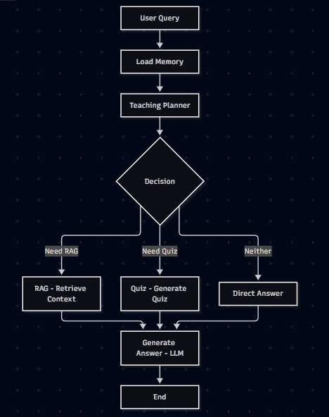
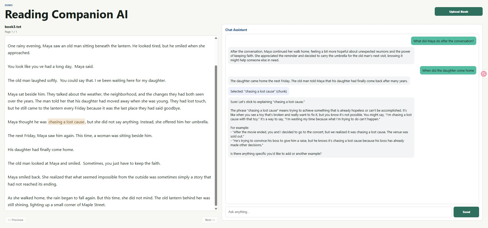

# Reading Companion AI

An AI-powered reading companion that helps users understand books through conversational interaction, retrieval-augmented generation (RAG), and an agentic workflow.

## Overview

Reading Companion AI allows users to upload and read a book while interacting with a local Large Language Model (LLM).

The system can:

* Answer questions about the current book
* Retrieve relevant passages from the book using RAG
* Analyze the user's reading content to generate annotations and explanations
* Use an agentic workflow to decide when additional interaction is needed
* Store and retrieve book information using a vector database
* Run locally using Ollama

## Agentic Workflow

The application uses LangGraph to manage the reading interaction.



This helps the model ground its answers in the actual book content.

## Tech Stack

### Frontend

* Next.js
* React
* TypeScript

### Backend

* Python
* FastAPI
* LangGraph

### AI / NLP

* Ollama
* Qwen2.5:3B

### Database

* Chroma

### Deployment

* Docker
* Docker Compose

## Running Locally

### Requirements

* Python
* Node.js
* Docker
* Ollama

Make sure the required Ollama model is available:

```bash
ollama pull qwen2.5:3b
```

### Run with Docker Compose

From the project root:

```bash
docker compose up --build
```

The application will be available at:

```text
Frontend: http://localhost:3000
Backend:  http://localhost:8000
API Docs: http://localhost:8000/docs
```
For subsequent runs without code changes:

```bash
docker compose up
```

If the code has changed:

```bash
docker compose up --build
```

## Interface



## Future Improvements

